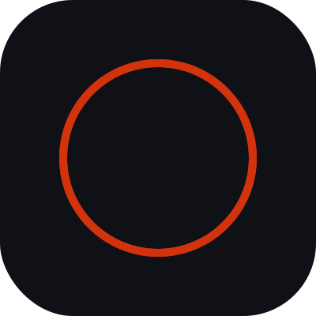

  

<h1 align="center">hi there!</h1>

If you’re a recruiter, everything here is intentional. If you’re a developer, no it isn’t.

## Working On

  Head down at
  
  <a href="https://whagons.com/en">Whagons</a>

---

## Open Source

Projects I care about most right now:

- [Gonvex](https://github.com/Desarso/gonvex): Convex-ish, but I got Go involved.
- [Godantic](https://github.com/Desarso/godantic-): inspired by [Pydantic AI](https://github.com/pydantic/pydantic-ai), but Go, faster, and WebSocket-forward.

---

## Notes

- Why would you think I like Golang?
- My job consists of getting mad at a terminal-based agent while I tell it, in broken English, to do stuff.

---

## Tools

  

---

## Elsewhere

- More: [gabriemalek.com](https://gabriemalek.com)
