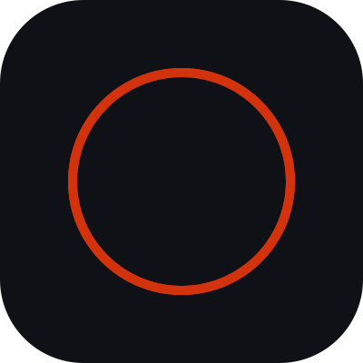

  

<h1 align="center">hi there!</h1>

If you’re a recruiter, everything here is intentional. If you’re a developer, no it isn’t.

## Working On

  
  <a href="https://whagons.com/en">Whagons</a>

---

## Open Source

Projects I care about most right now:

- [Gonvex](https://github.com/Whagons-International/gonvex): Convex-ish, on Postgres. Started in Go, now a Rust runtime running TypeScript in V8.
- [Godantic](https://github.com/Desarso/godantic): inspired by [Pydantic AI](https://github.com/pydantic/pydantic-ai), but Go and WebSocket-forward.
- [Pageup](https://github.com/Desarso/pageup): local HTML to an unlisted URL in one signed request.
- [Mandelbrot WebGPU](https://github.com/Desarso/mandelbrot-webgpu): arbitrary-precision deep zoom, computed on the GPU.

---

## Notes

- Why would you think I like Golang?

---

## Tools

  

---

## Elsewhere

- Write-ups of these and the apps I run my day on: [gabrielmalek.com](https://gabrielmalek.com)
